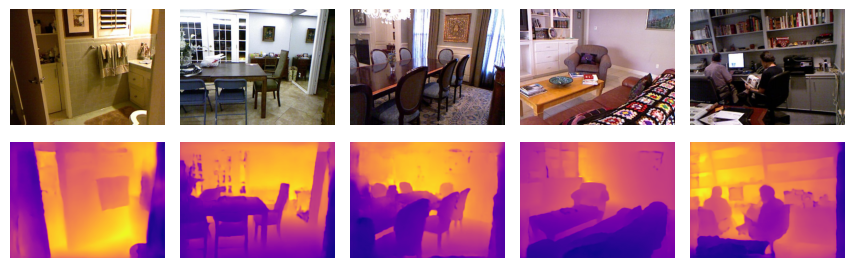

<div align="center">
<h1>Hybrid Depth: Robust Depth Fusion for Mobile AR </br> By Leveraging Depth from Focus and Single-Image Priors</h1>

[**Ashkan Ganj**](https://ashkanganj.me/)<sup>1</sup> · [**Hang Su**](https://suhangpro.github.io/)<sup>2</sup> · [**Tian Guo**](https://tianguo.info/)<sup>1</sup>

<sup>1</sup>Worcester Polytechnic Institute
&emsp;&emsp;&emsp;<sup>2</sup>Nvidia Research

<a href="https://arxiv.org/pdf/2407.18443"></a>
<a href=''></a>
[](https://paperswithcode.com/sota/monocular-depth-estimation-on-arkitscenes?p=hybriddepth-robust-depth-fusion-for-mobile-ar)
[](https://paperswithcode.com/sota/monocular-depth-estimation-on-nyu-depth-v2?p=hybriddepth-robust-depth-fusion-for-mobile-ar)
</div>

This work presents HybridDepth. HybridDepth is a practical depth estimation solution based on focal stack images captured from a camera. This approach outperforms state-of-the-art models across several well-known datasets, including NYU V2, DDFF12, and ARKitScenes.


## News

- **2024-07-25:** We released the pre-trained models.
- **2024-07-23:** Model and Github repository is online.

## TODOs

- [ ] Add Hugging Face model.
- [ ] Release Android Mobile Client for HybridDepth.

## Pre-trained Models

We provide **three models** trained on different datasets. You can download them from the links below:

| Model | Checkpoint |
|:-|:-:|
| Hybrid-Depth-NYU-5 | [Download](https://github.com/cake-lab/HybridDepth/releases/download/v1.0/NYUBestScaleInv5Full.ckpt) |
| Hybrid-Depth-NYU-10 | [Download](https://github.com/cake-lab/HybridDepth/releases/download/v1.0/NYUBestScaleInv10Full.ckpt) |
| Hybrid-Depth-DDFF12-5 | [Download](https://github.com/cake-lab/HybridDepth/releases/download/v1.0/DDFF12BestScaleInv.ckpt) |
| Hybrid-Depth-ARKitScenes-5 | [Download](https://github.com/cake-lab/HybridDepth/releases/download/v1.0/scaleInvARKitScenes5.ckpt) |

## Usage

### Prepraration
1. **Clone the repository and install the dependencies:**
```bash
git clone https://github.com/cake-lab/HybridDepth.git
cd HybridDepth
conda env create -f environment.yml
conda activate hybriddepth
```
2. **Download Necessary Files:**
   * Download the necessary file [here](https://github.com/cake-lab/HybridDepth/releases/download/v1.0/DFF-DFV.tar) and place it in the checkpoints directory.
   * Download the checkpoints listed [here](#pre-trained-models) and put them under the `checkpoints` directory.

#### Dataset Preparation

1. **NYU:**
Download dataset as per instructions given [here](https://github.com/cleinc/bts/tree/master/pytorch#nyu-depvh-v2).

1. **DDFF12:**
Download dataset as per instructions given [here](https://github.com/fuy34/DFV).
1. **ARKitScenes:**
Download dataset as per instructions given [here](https://github.com/cake-lab/Mobile-AR-Depth-Estimation).

### Using HybridDepth model for prediction

For inference you can run the provided notebook `test.ipynb` or use the following command:

```python
# Load the model checkpoint
model_path = './checkpoints/checkpoint.ckpt'
model = DepthNetModule()
# Load the weights
model.load_state_dict(torch.load(model_path))

model.eval()
model = model.to('cuda')
```

After loading the model, you can use the following code to process the input images and get the depth map:

```python

from utils.io import prepare_input_image

data_dir = 'focal stack images directory'

# Load the focal stack images
focal_stack, rgb_img, focus_dist = prepare_input_image(data_dir)

# inference
with torch.no_grad():
   out = model(rgb_img, focal_stack, focus_dist)

metric_depth = out[0].squeeze().cpu().numpy() # The metric depth
```

### Evaluation

First setup the configuration file `config.yaml` in the `configs` directory. We already provide the configuration files for the three datasets in the `configs` directory. In the configuration file, you can specify the path to the dataloader, the path to the model, and other hyperparameters. Here is an example of the configuration file:

```yaml
data:
  class_path: dataloader.dataset.NYUDataModule # Path to your dataloader Module in dataset.py
  init_args:
    nyuv2_data_root: 'root to the NYUv2 dataset or other datasets' # path to the specific dataset
    img_size: [480, 640]  # Adjust if your DataModule expects a tuple for img_size
    remove_white_border: True
    num_workers: 0  # if you are using synthetic data, you don't need multiple workers
    use_labels: True

model:
  invert_depth: True # If the model outputs inverted depth

ckpt_path: checkpoints/checkpoint.ckpt
```

Then specify the configuration file in the `test.sh` script.

```bash
python cli_run.py test  --config configs/config_file_name.yaml
```

Finally, run the following command:

```bash
cd scripts
sh evaluate.sh
```

### Training

First setup the configuration file `config.yaml` in the `configs` directory. You only need to specify the path to the dataset and the batch size. The rest of the hyperparameters are already set.
For example, you can use the following configuration file for training on the NYUv2 dataset:

```yaml
...
model:
  invert_depth: True
  # learning rate
  lr: 3e-4 # you can adjust this value
  # weight decay
  wd: 0.001 # you can adjust this value

data:
  class_path: dataloader.dataset.NYUDataModule # Path to your dataloader Module in dataset.py
  init_args:
    nyuv2_data_root: 'root to the NYUv2 dataset or other datasets' # path to the specific dataset
    img_size: [480, 640]  # Adjust if your NYUDataModule expects a tuple for img_size
    remove_white_border: True
    batch_size: 24 # Adjust the batch size
    num_workers: 0  # if you are using synthetic data, you don't need multiple workers
    use_labels: True
ckpt_path: null
```

Then specify the configuration file in the `train.sh` script.

```bash
python cli_run.py train  --config configs/config_file_name.yaml
```

Finally, run the following command:

```bash
cd scripts
sh train.sh
```

## Citation
If our work assists you in your research, please cite it as follows:

```Bibtex
@misc{ganj2024hybriddepthrobustdepthfusion,
      title={HybridDepth: Robust Depth Fusion for Mobile AR by Leveraging Depth from Focus and Single-Image Priors}, 
      author={Ashkan Ganj and Hang Su and Tian Guo},
      year={2024},
      eprint={2407.18443},
      archivePrefix={arXiv},
      primaryClass={cs.CV},
      url={https://arxiv.org/abs/2407.18443}, 
}
```
